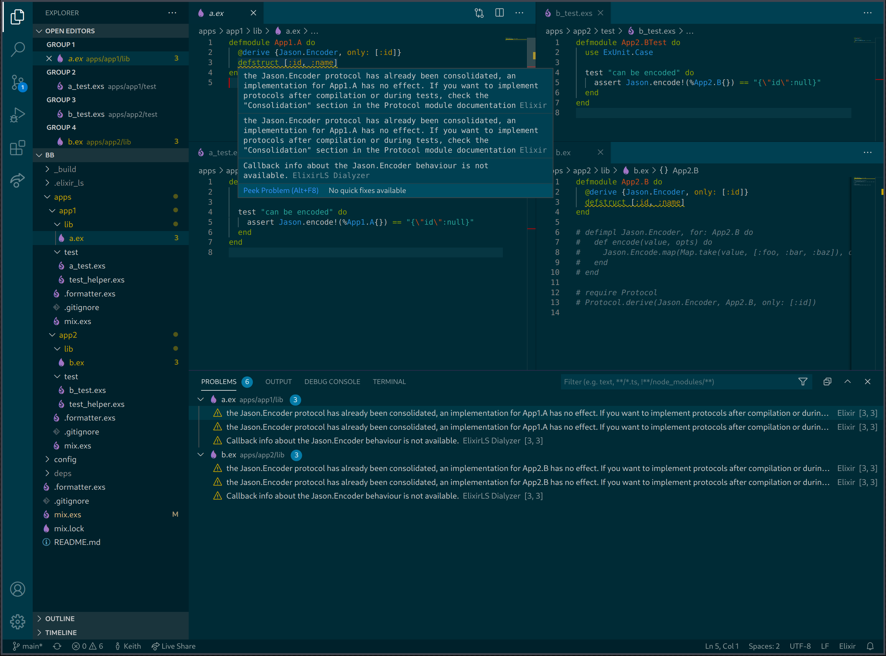

# Bb

Struggling with protocols in an umbrella project:

Both `App1` and `App2` have `Jason` as a dependency.

`App1` contains a struct A
`App2` contains a struct B

Both structs need to implement the `Jason.Encoder` protocol.

`iex -S mix` and `mix test` both run fine, but `ElixirLS` in vscode is showing the protocol consolidation error.

Not sure how to resolve.

Any suggestions?

